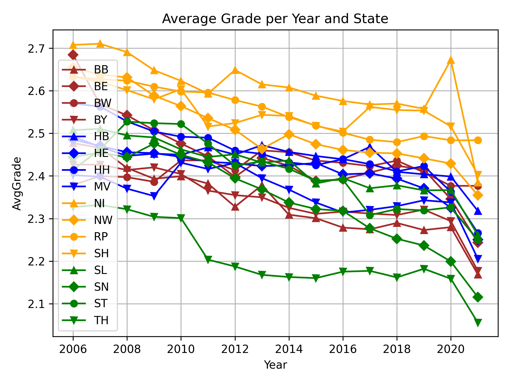

# Noteninflation
Plotting data about school grades of the German highschool diploma (Abitur). Data is taken from the [Kultusministerkonferenz](https://www.kmk.org/dokumentation-statistik/statistik/schulstatistik/abiturnoten.html) (conference of the ministers of education; education is organized by the 16 states in Germany, not the federal government).

An ongoing topic of debate in Germany is the continuous improvement of grades for the graduation of our highest school level. This should normally be a reason to be pleased about the progress of our education system, however one needs to ensure this improvement is due to the students improving, not due to the tests getting easier. While the grades of high school students improved over time, this does not correlate to the performance of german students in the PISA test. I did not plot the PISA results (the data is much sparsers and not as nice), but you can see the PISA resuslts on [Wikipedia](https://en.wikipedia.org/wiki/Programme_for_International_Student_Assessment). Suffice to say that from 2000 to 2012 the trend in PISA and Abitur is the same (in both tests the grades of german students improved), however while the improvement of grades continued for the German Abitur, the PISA study in 2015 showed a clear drop in the results for german students, with some results dropping to the level of the tests from 2006.

I should also point out that PISA receives a lot of criticism. While I did not read up on the details, the german Wikipedia has a lengthy article about it [here](https://de.wikipedia.org/wiki/Kritik_an_den_PISA-Studien).

# Interesting Plots

Note: German grades are on a scale from 1.0 to 6.0 with 1 being the best, 4 just passing and 6 is failing.

The main point: Plotting average grade versus Year of the Abitur exam. As you can see there is a continuous improvement with an even steeper drop due to Corona. It will be interesting to revisit this topic in a few years to see how the restrictions on schools during Corona influenced the grades long term.

The same plot as above, but now split into states. All 16 states show a similar rate of grade improvement, and a similar drop due to Corona.

As you may have noticed one state showed an interesting development, with grades spiking to a much worse average in 2020. This is Lower Saxony, which switched back from a shortened 4+8 Year curriculum to the longer 4+9 year curriculum. The so called G8 (8 grades of Gymnasium instead of 9) was in effect for the students graduating between 2011 and 2019. This lead to a spike in graduating students in 2011 (with both students from 2003 (G8), as well as 2002 (G9) graduating in 2011) and a drop in 2020, where only those who entered Gymnasium in 2011, but didn't complete in 8 years took the exams.

